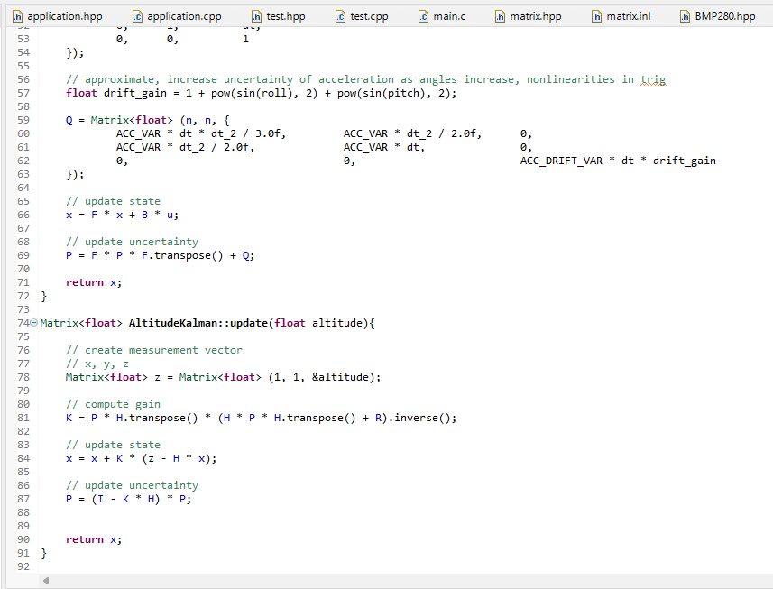

# Drone Controller

The control board is based around an STM32f401 MCU. For power regulation a buck converter is used to generate steady 3.3v from a 4s LiPO Battery or USB 5v line. When powered over battery, the highside power latch allows the board to be toggled on or off.

To allow for closed loop control a BMP280 barometer and an ICM42670P IMU are connected over I2C, and PWM is used to communicate with the motor ESCs and controller receiver. Programming is done over USB, and pins are exposed for UART, I2C, and SWD protocols for extensibility.

Four layers were used to make routing easier and improve signal integrity.

## Routing

## Schematic

# Code

State estimation is achieved with two Kalman filters (attitude and altitude), and PID controllers are used in combination with a mixer to get final motor throttle values.

Custom drivers were written to interface with the sensors, and a matrix math library was written using c++ operator overloading - this allows for readable state space control code. The IMU driver reads when triggered by a pin interupt, and the barometer driver uses polling.

A testing routine was written which can be run instead of the main drone loop - it runs unit tests for the code, then tests operation of the sensors, motors, Kalman filters, and status light.

The firmware automatically turns the drone off when the battery voltage drops below a safe level.

Controller Code is Contained in Firmare/Core/

## Code Structure

# Frame

The frame was designed in fusion 360 and was 3d printed using PETG plastic. Care was taken to maximize rigidity whilst minimizing weight.
